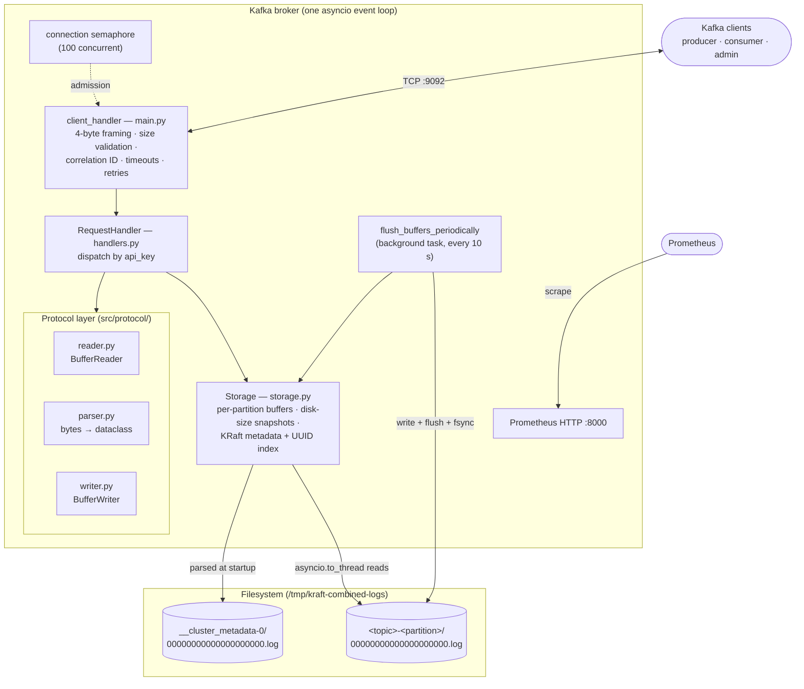
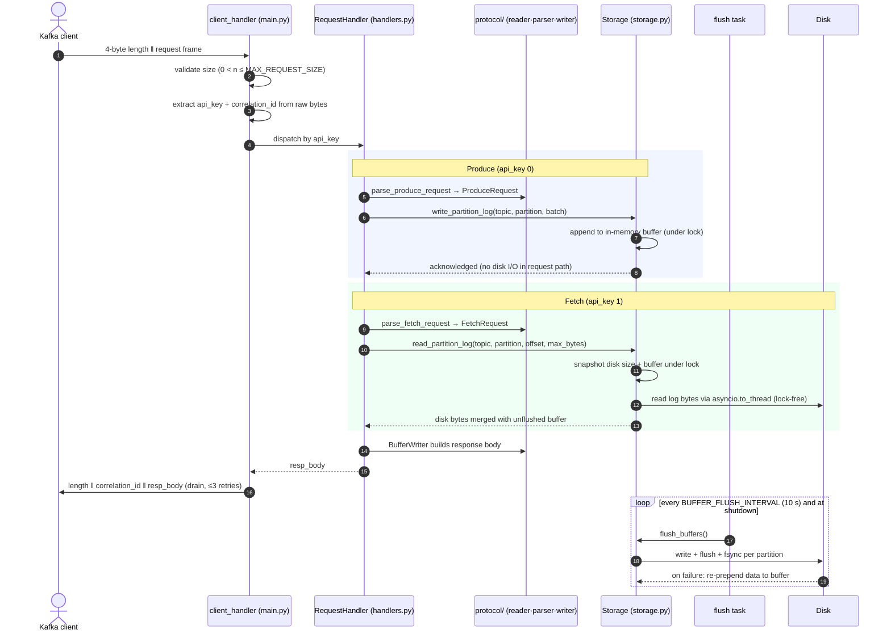

# Kafka Broker

A from-scratch Apache Kafka broker in Python, built on a single `asyncio`
event loop. It speaks the Kafka binary wire protocol directly over raw TCP 
(no Kafka libraries in between) and implements four broker APIs end to end:
`Produce`, `Fetch`, `ApiVersions`, and `DescribeTopicPartitions`, from
low-level byte (de)serialization, through KRaft `__cluster_metadata` parsing,
to a buffered, fsync-durable storage layer, all behind a single
`python -m src.main` entry point.

<p>
  
  
  
  
</p>

> Built as a [CodeCrafters](https://codecrafters.io/challenges/kafka) "Build your own Kafka"
> track, then extended well past the grading surface: graceful drain-and-flush
> shutdown, semaphore admission control, per-operation timeouts, batched
> flush+fsync durability with no-loss failure recovery, structured JSON
> logging, Prometheus metrics, a 457-test suite, and a benchmark-driven
> read-path optimization that lifted fetch throughput 3.35x.

---

## Table of contents

- [Project Overview](#project-overview)
- [Features](#features)
- [System Architecture](#system-architecture)
- [Project Structure](#project-structure)
- [Requirements](#requirements)
- [Installation](#installation)
- [Quick start](#quick-start)
- [Usage](#usage)
- [Configuration](#configuration)
- [Observability](#observability)
- [Performance](#performance)
- [Reliability & durability model](#reliability--durability-model)
- [Development](#development)
- [Testing](#testing)
- [Troubleshooting](#troubleshooting)
- [Acknowledgements](#acknowledgements)

---

## Project Overview

This broker implements the Kafka wire protocol against raw TCP sockets and
handles four API keys:

| API | Key | Purpose |
| --- | --- | --- |
| `Produce` | 0 | Append records to a partition log |
| `Fetch` | 1 | Read records from a partition log |
| `ApiVersions` | 18 | Advertise supported APIs and version ranges |
| `DescribeTopicPartitions` | 75 | Return topic/partition metadata |

Cluster metadata (topics, partitions, replicas, leaders) is sourced from a
KRaft-style `__cluster_metadata` log parsed once at startup. Produced records
are buffered in memory and flushed to per-partition log files with `fsync`
every 10 seconds and at shutdown, while reads transparently merge on-disk
data with not-yet-flushed buffered data so consumers always see the latest
writes.

It began as a [CodeCrafters](https://codecrafters.io/challenges/kafka) "Build
your own Kafka" implementation and was then hardened beyond the grading
surface. Three goals drive the design:

1. **Correctness as a contract.** The protocol layer, handlers, storage, and
   connection lifecycle are pinned by 457 unit, integration, and end-to-end
   tests, so wire-format behaviour is asserted, not incidental.
2. **A responsive event loop under load.** Everything blocking, every file
   read and write, is offloaded via `asyncio.to_thread`; a connection
   semaphore provides admission control; the hot fetch path reads the
   append-only log lock-free.
3. **Operability.** Structured JSON logs, four Prometheus metrics, graceful
   signal-driven shutdown, and per-request fault isolation make the broker
   observable and debuggable while it runs.

The codebase is deliberately small and strictly layered: transport, dispatch,
protocol, and storage each live in one module, and the wire format is fully
decoupled from business logic.

---

## Features

- **Four broker APIs end to end**: `Produce`, `Fetch`, `ApiVersions`, and
  `DescribeTopicPartitions`, parsed from raw bytes into typed `@dataclass`
  request objects and answered in correct Kafka wire format.
- **KRaft metadata parsing**: the `__cluster_metadata` record-batch log is
  decoded at startup into a by-name topic index plus a UUID-keyed index for
  O(1) `Fetch` lookups.
- **Buffered, durable writes**: produces are acknowledged from per-partition
  in-memory buffers; a background task batches them to disk with
  write + flush + `fsync` every 10 seconds and again at shutdown.
- **No-loss flush failure handling**: if a flush fails, the affected bytes
  are *prepended* back onto the partition buffer, preserving order for the
  next flush cycle.
- **Read-through buffer merge**: fetches combine on-disk bytes with the live
  write buffer, so a consumer never waits for a flush to observe a recent
  produce.
- **Non-blocking by construction**: a single `asyncio` event loop
  multiplexes all connections; all file I/O runs in `asyncio.to_thread`;
  a semaphore caps concurrent connections at 100.
- **Defensive transport**: 4-byte length-prefix framing with size validation
  (`MAX_REQUEST_SIZE`), per-read/write timeouts, bounded write retries, and
  per-request fault isolation (one bad request never tears down the server).
- **Observability built in**: structured JSON logging via `structlog` with
  per-connection context, and Prometheus metrics on a dedicated HTTP port.

---

## System Architecture

A strictly layered design: the transport owns the sockets, handlers own the
dispatch, the protocol layer owns the bytes, and storage owns the disk.

| Module | Responsibility |
| --- | --- |
| `src/main.py` | TCP accept loop, framing, correlation IDs, connection lifecycle, signal handling, background flush task, metrics endpoint |
| `src/handlers.py` | `RequestHandler`: one `handle_*` method per API key; parse → storage → response body |
| `src/protocol/reader.py` | `BufferReader`: cursor-based deserializer (ints, UUIDs, varints, compact strings/arrays) |
| `src/protocol/writer.py` | `BufferWriter`: appends typed fields to an internal `bytearray` |
| `src/protocol/parser.py` | Stateless functions: `BufferReader` → typed request dataclasses |
| `src/protocol/messages.py` | `@dataclass` definitions for all request types |
| `src/storage.py` | `Storage`: KRaft metadata parsing, buffered writes, merged reads, durable flush |
| `src/utils.py` | Shared helpers (unsigned varint encoding) |

Two cross-cutting rules shape the design:

1. **Handlers never touch sockets or framing.** They receive request bytes
   and return only a response body; the transport prepends the length prefix
   and correlation ID.
2. **The event loop never blocks on disk.** Every file operation is
   dispatched via `asyncio.to_thread`.

### High-level system architecture



**Key edges**

- `client_handler` is the only layer that reads or writes sockets; it
  extracts the API key (`bytes[4:6]`) and correlation ID (`bytes[8:12]`)
  straight from the raw frame.
- `Storage` snapshots the committed disk size in memory and reads the
  append-only log **outside** its lock, so fetches scale with concurrency.
- The flush task is the only writer to partition log files; requests only
  ever touch memory on the write path.

### Request lifecycle — a Produce and a Fetch



`ApiVersions` and `DescribeTopicPartitions` follow the same frame → dispatch
→ parse → respond path; they consult the in-memory metadata index instead of
partition logs.

---

## Project Structure

```
kafka-broker/
├── src/
│   ├── main.py              # entry point: TCP server, framing, lifecycle,
│   │                        #   signals, metrics, background flush task
│   ├── handlers.py          # RequestHandler: one method per API key
│   ├── storage.py           # Storage: KRaft parsing, buffered writes,
│   │                        #   merged reads, durable flush
│   ├── utils.py             # unsigned varint encoding helper
│   └── protocol/
│       ├── reader.py        # BufferReader: cursor-based deserializer
│       ├── writer.py        # BufferWriter: bytearray response builder
│       ├── parser.py        # stateless parsers (bytes → dataclass)
│       └── messages.py      # @dataclass request definitions
├── tests/
│   ├── test_reader.py       # 107 tests — deserialization primitives
│   ├── test_writer.py       # 100 tests — serialization primitives
│   ├── test_parser.py       #  51 tests — request parsing
│   ├── test_handlers.py     #  49 tests — per-API handler behaviour
│   ├── test_storage.py      #  47 tests — metadata, flush, merged reads
│   ├── test_main.py         #  30 tests — framing, timeouts, lifecycle
│   └── test_utils.py        #   7 tests — varint encoding
├── conftest.py              # adds the repo root to sys.path
└── requirements.txt         # structlog + prometheus-client
```

| Layer | Module(s) | Role |
| --- | --- | --- |
| Transport | `main.py` | sockets, framing, lifecycle, admission control |
| Application | `handlers.py` | per-API dispatch and response assembly |
| Protocol (pure) | `protocol/`, `utils.py` | byte-level (de)serialization, no I/O |
| Storage | `storage.py` | metadata, buffers, disk |

---

## Requirements

- **Python 3.10+** (the code uses modern typing syntax such as
  `dict[str, dict]` and `list[...]`).
- Two runtime dependencies (see `requirements.txt`):

| Dependency | Role |
| --- | --- |
| [`structlog`](https://pypi.org/project/structlog/) | structured JSON logging |
| [`prometheus-client`](https://pypi.org/project/prometheus-client/) | metrics exposition on `:8000` |

`mypy` is used for development-time type checking (`mypy src/`).

### Metadata prerequisite

`Fetch`, `Produce`, and `DescribeTopicPartitions` rely on cluster metadata
read at startup from a KRaft `__cluster_metadata` log:

```
/tmp/kraft-combined-logs/
├── __cluster_metadata-0/
│   └── 00000000000000000000.log     # parsed at startup (topics, partitions, leaders)
├── <topic>-0/
│   └── 00000000000000000000.log     # partition 0 log
└── <topic>-1/
    └── 00000000000000000000.log     # partition 1 log
```

If the metadata log is absent, the broker still starts and serves requests,
just with an empty topic set (unknown-topic responses).

---

## Installation

```bash
# 1. Clone
git clone https://github.com/sibomana-si/kafka-broker.git
cd kafka-broker

# 2. (Recommended) create a virtual environment
python3 -m venv .venv
source .venv/bin/activate          # Windows: .venv\Scripts\activate

# 3. Install runtime dependencies
pip install -r requirements.txt
```

---

## Quick start

```bash
# Start the broker (Kafka protocol on localhost:9092, metrics on :8000)
python -m src.main

# In another terminal: scrape the Prometheus metrics
curl -s localhost:8000 | grep kafka_server

# Point any Kafka client at localhost:9092, e.g. the Apache Kafka CLI tools
kafka-topics.sh --bootstrap-server localhost:9092 --describe

# Stop with Ctrl-C (SIGINT) or SIGTERM — the broker drains active
# connections and performs a final durable flush before exiting
```

The broker emits structured JSON logs to stdout from the moment it starts
(`server_started`, `metrics_server_started`, per-connection events).

---

## Usage

The broker has no subcommands; it is a server. Interaction happens over the
Kafka wire protocol on `localhost:9092`.

### Supported APIs

| API | Key | Versions advertised | Purpose |
| --- | --- | --- | --- |
| `Produce` | 0 | 0–11 | append a record batch to a partition log |
| `Fetch` | 1 | 0–16 | read records for a topic UUID + partition from a given offset |
| `ApiVersions` | 18 | 0–4 | list the APIs and version ranges above |
| `DescribeTopicPartitions` | 75 | 0 | topic UUID, partitions, leaders, replicas by topic name |

A typical session: a client sends `ApiVersions` to discover support, then
`DescribeTopicPartitions` to resolve a topic name to its UUID and partitions,
then `Produce` to append records and `Fetch` (addressing the topic by UUID)
to read them back, including records that have not yet been flushed to disk.

### Wire behaviour

- Every request and response is framed with a **4-byte big-endian length
  prefix**; request payloads are validated against `MAX_REQUEST_SIZE` (1 MB).
- The **correlation ID** from the request header (`bytes[8:12]`) is echoed
  back as the first field of every response.
- Compact strings and arrays use the Kafka **unsigned-varint** convention
  where the encoded value is `length + 1` (so `0` encodes null).

### Error codes

| Code | Meaning | Returned when |
| --- | --- | --- |
| `0` | NONE | success |
| `3` | UNKNOWN_TOPIC_OR_PARTITION | `DescribeTopicPartitions`/`Produce` for a topic or partition not in metadata |
| `35` | UNSUPPORTED_VERSION | `ApiVersions` request with a version outside 0–4 |
| `100` | UNKNOWN_TOPIC_ID | `Fetch` for a topic UUID not in metadata |

---

## Configuration

All tunables are module-level constants at the top of `src/main.py`, no
environment variables or config files.

| Constant | Default | Description |
| --- | --- | --- |
| `LOG_FILES_DIR` | `/tmp/kraft-combined-logs` | root directory for all log files (metadata + partition logs) |
| `LOG_FILE_NAME` | `00000000000000000000.log` | per-partition log file name |
| `CLIENT_READ_TIMEOUT` | `5` | per-read timeout (seconds) |
| `CLIENT_WRITE_TIMEOUT` | `5` | per-write/drain timeout (seconds) |
| `MAX_WRITE_RETRIES` | `3` | max retries for a failed socket write |
| `MAX_CONCURRENT_CONNECTIONS` | `100` | connection semaphore limit |
| `GRACEFUL_SHUTDOWN_TIMEOUT` | `10.0` | drain window on `SIGINT`/`SIGTERM` (seconds) |
| `BUFFER_FLUSH_INTERVAL` | `10` | seconds between background buffer flushes |
| `MAX_REQUEST_SIZE` | `1_048_576` | maximum accepted request payload (1 MB) |

Network settings are set in `main()`:

| Setting | Default | Description |
| --- | --- | --- |
| Broker host | `localhost` | TCP listen address |
| Broker port | `9092` | Kafka wire-protocol port |
| Metrics port | `8000` | Prometheus metrics HTTP endpoint |

---

## Observability

**Structured logging.** Every log line is machine-parseable JSON via
`structlog` (ISO timestamps, log level, logger name). Connection logs are
bound with the client address, and lifecycle transitions are discrete
events: `connection_accepted`, `client_read_timeout`,
`request_handling_error`, `flushing_buffers_to_disk`,
`shutdown_event_received`, `server_shutdown_complete`, and more.

**Prometheus metrics**, served on `http://localhost:8000/`:

| Metric | Type | Labels |
| --- | --- | --- |
| `kafka_server_requests_total` | Counter | `api_key` (produce/fetch/api_versions/describe_topic_partitions/unknown), `status` (success/error) |
| `kafka_server_request_duration_seconds` | Histogram | `api_key` |
| `kafka_server_active_connections` | Gauge | — |
| `kafka_server_disk_flush_duration_seconds` | Histogram | — |

---

## Performance

Measured with a custom wire-protocol benchmark driving the broker's own
connection handler with real Kafka frames.

- **Write path:** ~10,800 produce req/s at p99 < 5 ms across 50 concurrent
  connections; produces are acknowledged from memory and batched to disk
  every 10 s, so there is no disk I/O in the request path.
- **Read path:** the original fetch path serialized behind a read lock that
  held disk I/O in its critical section; throughput peaked at a single
  connection and p99 reached 53 ms at 100 connections. Restructuring reads
  to snapshot the committed disk size in memory and read the append-only log
  lock-free improved fetch throughput **3.35x** (2,853 → 9,549 req/s at 50
  connections) and p99 latency **~5x** (26.5 → 5.5 ms), lifting fetch from
  17% to 56% of the broker's measured protocol ceiling (~17k req/s for a
  storage-free request) and making reads scale with concurrency.

---

## Reliability & durability model

The broker trades a bounded durability window for write throughput, and is
explicit about it:

- **Batched flush+fsync.** Buffered produces are written, `flush()`ed, and
  `fsync()`ed to disk every `BUFFER_FLUSH_INTERVAL` (10 s) and again during
  shutdown. Once flushed, data survives process and OS crashes.
- **Durability window.** Produces are acknowledged from memory; on a hard
  crash (e.g. `SIGKILL`, power loss) up to 10 s of acknowledged writes can
  be lost. A graceful `SIGINT`/`SIGTERM` loses nothing, the shutdown path
  ends with a final flush.
- **No-loss flush failure recovery.** If a disk flush fails, the unwritten
  bytes are prepended back onto the partition buffer, preserving order, and
  retried on the next cycle.
- **Graceful shutdown.** On `SIGINT`/`SIGTERM`: stop accepting → wait up to
  `GRACEFUL_SHUTDOWN_TIMEOUT` (10 s) for active connections to drain →
  force-cancel stragglers → cancel the flush task → final durable flush.
- **Defensive request handling.** Frame sizes are validated against
  `MAX_REQUEST_SIZE` (1 MB) and negative/truncated reads are rejected;
  per-operation read/write timeouts (5 s) unstick slow clients; failed
  socket writes retry at most `MAX_WRITE_RETRIES` (3) times; a semaphore
  caps concurrent connections at 100.
- **Fault isolation.** An exception while handling one request is logged,
  counted in the error metric, and answered without tearing down the server
  or other connections.

---

## Development

```bash
# Run the broker locally
python -m src.main

# Type-check
mypy src/
```

All tunables live as constants at the top of `src/main.py`, adjust
`LOG_FILES_DIR`, timeouts, or the flush interval there. Structured JSON logs
on stdout are the primary debugging surface; the Prometheus endpoint on
`:8000` gives live request/latency/flush numbers.

---

## Testing

The suite has **457 tests** covering every layer, from byte-level
(de)serialization primitives up to connection lifecycle and shutdown:

| Test file | Tests | Covers |
| --- | --- | --- |
| `tests/test_reader.py` | 107 | `BufferReader` primitives, varints, compact strings/arrays |
| `tests/test_writer.py` | 100 | `BufferWriter` output, byte-exact encoding |
| `tests/test_parser.py` | 51 | request parsing (bytes → dataclasses) |
| `tests/test_handlers.py` | 49 | per-API handler behaviour and error codes |
| `tests/test_storage.py` | 47 | KRaft metadata parsing, flush, merged reads |
| `tests/test_main.py` | 30 | framing, timeouts, retries, shutdown |
| `tests/test_utils.py` | 7 | unsigned varint encoding |

```bash
# Run the full suite (from the repo root)
python3 -m pytest tests/ -v

# One file
python3 -m pytest tests/test_storage.py -v
```

> **Run pytest from the repo root**: `conftest.py` adds the root to
> `sys.path` so `src` imports resolve.

Handler tests build real wire-format frames with small builder helpers
(`make_header`, `make_request`, `make_fetch_body`, ...) and mock `Storage`
with `AsyncMock`, so they assert byte-exact responses without touching disk.

---

## Troubleshooting

| Symptom | Likely cause / fix |
| --- | --- |
| Every topic returns error 3 / 100 (unknown topic) | No metadata log at `/tmp/kraft-combined-logs/__cluster_metadata-0/00000000000000000000.log` — the broker started with an empty topic set. Provide a KRaft metadata log (expected fallback otherwise). |
| `OSError: address already in use` on start | Port 9092 (broker) or 8000 (metrics) is taken — stop the other process or change the port in `main()`. |
| Connections stall under heavy fan-out | The semaphore admits at most 100 concurrent connections; extra connections queue until a slot frees. Raise `MAX_CONCURRENT_CONNECTIONS` if your workload needs more. |
| Connection closed right after sending a request | The frame failed validation — payloads must be `0 < size ≤ 1 MB` (`MAX_REQUEST_SIZE`). |
| A produced record is not yet in the log file on disk | Expected: writes are buffered and flushed every 10 s. A `Fetch` still sees it immediately via the buffer merge; the file catches up on the next flush. |
| No log output visible | Logs are JSON on stdout — check where stdout is redirected; look for the `server_started` event. |

---

## Acknowledgements

Originally built on the [CodeCrafters](https://codecrafters.io/challenges/kafka)
"Build your own Kafka" challenge, implementing the
[Kafka wire protocol](https://kafka.apache.org/protocol) (request framing,
compact encodings, and the `Produce`, `Fetch`, `ApiVersions`, and
`DescribeTopicPartitions` APIs) from scratch.
